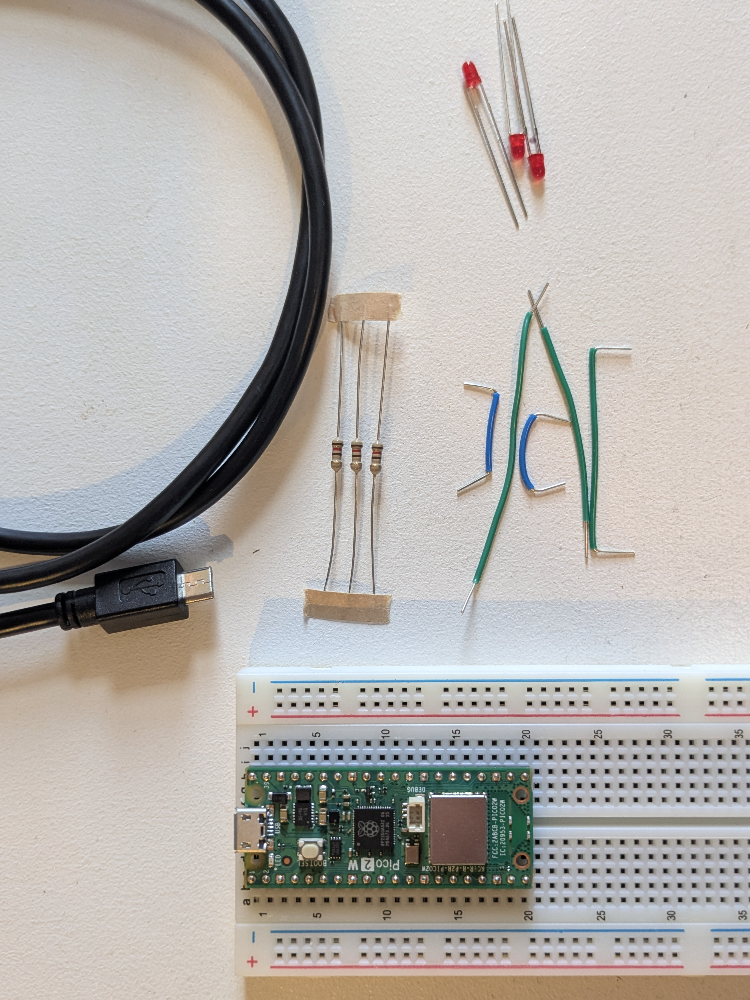
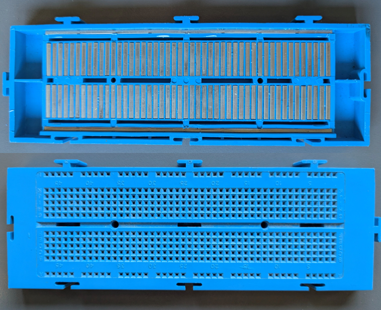
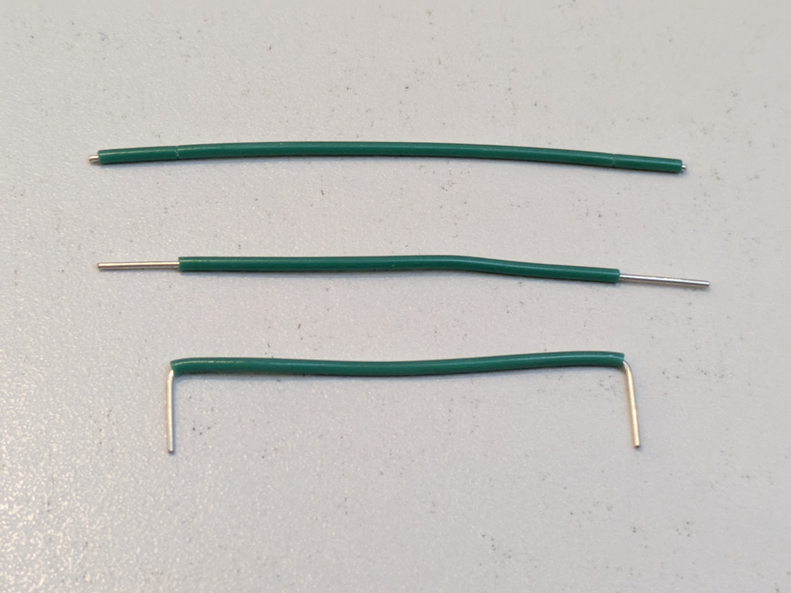
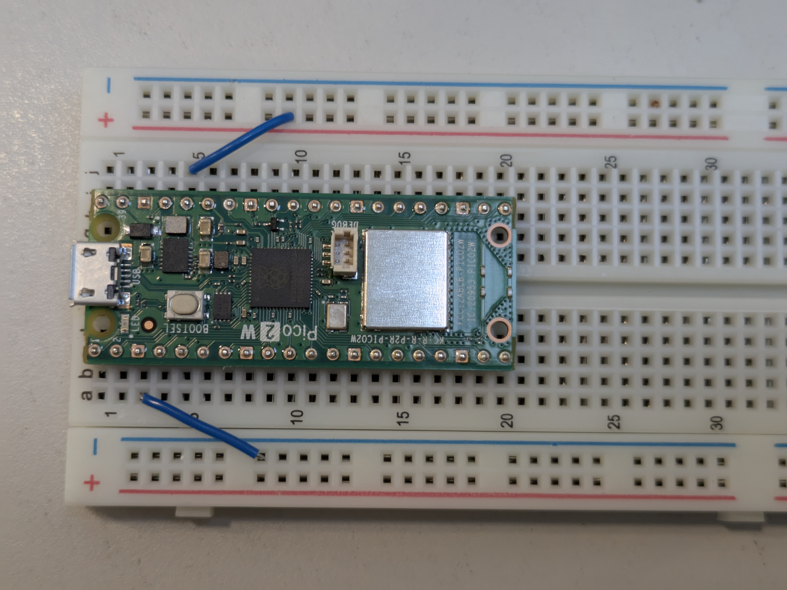
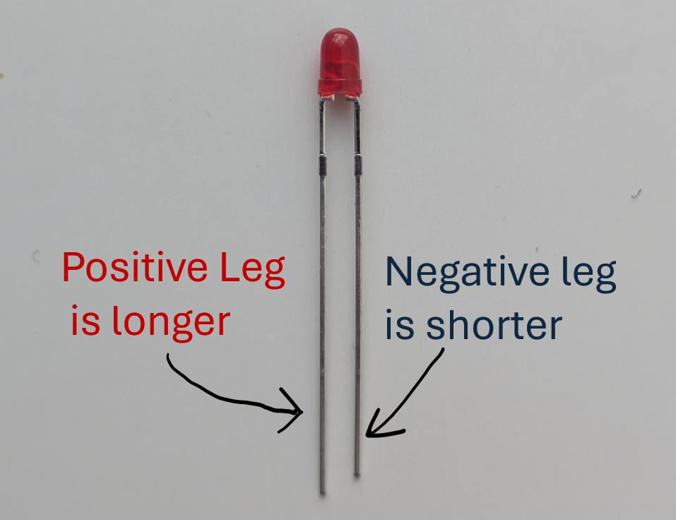
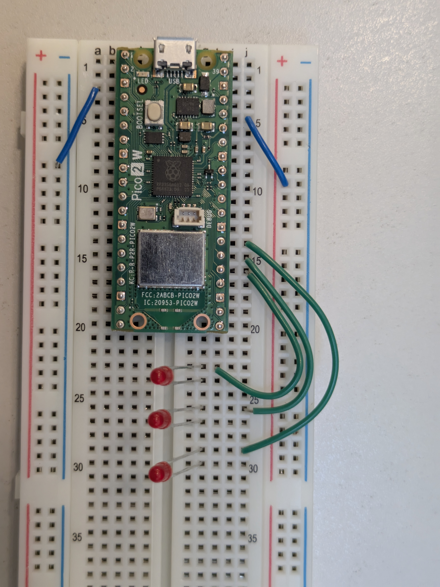
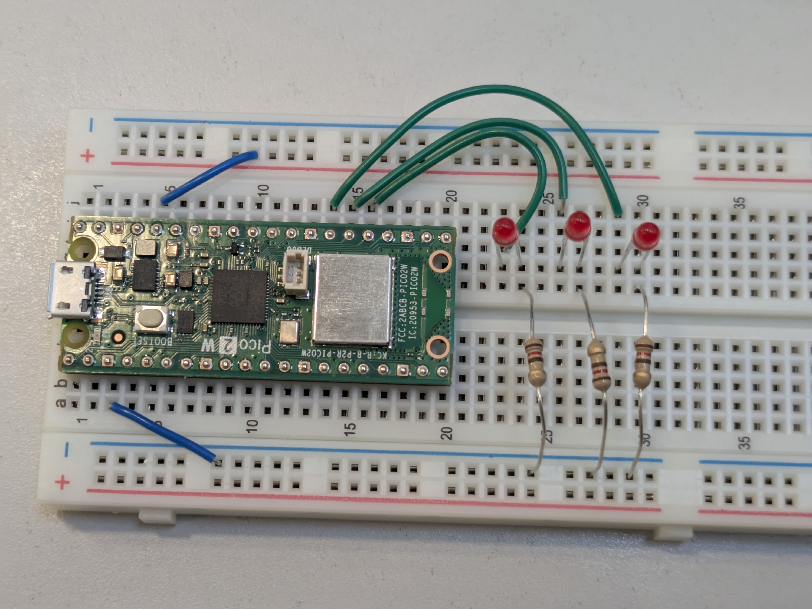

# 02 Flashing LEDs

We are going to be learning about how to use a breadboard, code and Pi Pico to control LEDs.

Here is the list of components you need:
 - Pi Pico 2 W already inserted onto a breadboard
 - Micro USB cable
 - x3 red LEDs
 - x3 120R resisters
 - x5 BreadBoard wires (you can always go back to get them when you know  what sizes you need)
 - Your own laptop or University laptop

 

## What is a Pi Pico?
It is a tiny computer or microccontroller that instead of running a operating system, runs a single program. It has pins along both sides to interact with hardware (e.g stuff on our breadboard).

## What is a breadboard?


Breadboards let you prototype circuits. Components and wires plug into holes that are connected internally with metal strips.

In the picture below, I've taken apart a slightly different style of breadboard. You can see that anything plugged into the holes along the outer edges are electrically connected together with a metal strip, which usually carries ground or power. The holes in the middle are connected by short vertical metal strips, separated by a split along the center.

</details>

## Building on the breadboard

1. Make sure your Pi Pico is unplugged from your computer while building on  the breadboard.

> [!NOTE]   
>You may  find you need to pull of the  insulation  at each end of the breadboard wires and bend the exposed ends 90 degrees.  
> 

2. The Pico provides power  and ground to the bread board though special pins.  
Choose an appropriate length breadboard wire and connect the Pico's pins shown in the picture. The upper row is Power - 3.3V and the lower row is ground - 0V. 


> [!WARNING]  
>Make sure positive leg of the  LED, is the one connected to the pico's pins. Connecting it the wrong way may cause the LED to break.  
> 

3. Next add the LEDs to the breadboard and connect the LED's positive legs to the correct  pins on the Pico, using breadboard wire.


3. The last step is to connect the other leg of the LED, to ground via 120R resistor. These resistors are important because they reduces the current flowing thought the LED, preventing it from burning out. 


## Creating and saving a program
1. Plug in the Pi Pico to the computer again. Press the red stop button near the top of the program to make it recognize the Pi Pico again.
1. To create a new python file. 
Go to the top "file"➡️"new".  
Then go "file"➡️"Save as..."➡️"This computer". Choose somewhere to save it with a name like "LedFlash.py". On university laptops save to your U drive.

## Controlling the LEDs

Each pin on the Pi Pico has a number. The following code tells the Pico that pins `19`, `20`, `21` are outputs and therefore can be used to control the LED as well as gives us a name we can reference in the code (`led1`, `led2` and `led3`).   
 Setting `.value(1)` means that pin is set to positive 3.3 volts, causing the connected LED to turn on.  

Type in the following code and click the green play button in the top left to run it:

```python
from machine import Pin

#define the LEDs pins
led1 = Pin(19, Pin.OUT)
led2 = Pin(20, Pin.OUT)
led3 = Pin(21, Pin.OUT)

#turn the LEDs on
led1.value(1)
led2.value(1)
led3.value(1)
```
## Dimming the LEDs
We can write a program to smoothly dim the LEDs on and off.   
To give the illusion of dimming we can turn the LEDs on and off a very fast rate using pulse width modulation (PWM).  

In the new code `freq=5000` tell each pin to pulse on and off `5000` times a second, which is to fast for the human eyes to notice.  

By using `.duty_u16` we can change what percentage of the time the on part of the pulse lasts. `.duty_u16(0)` is off the entire pulse duration and `.duty_u16(65535)` means it stay on for the entire pulse duration (max brightness).   

Replace the old code with this then run it:


```python
from machine import Pin, PWM
from time import sleep_ms

#define the LEDs pins
led1 = Pin(19, Pin.OUT)
led2 = Pin(20, Pin.OUT)
led3 = Pin(21, Pin.OUT)

#Set up PWM on those pins
pwmled1 = PWM(led1, freq=5000)
pwmled2 = PWM(led2, freq=5000)
pwmled3 = PWM(led3, freq=5000)

#Loop forever
while True:
    #The duty is decremented in steps of 100
    for duty in range(65536 ,0 , -100):
        
        #Set the pulse duration for all LEDs
        pwmled1.duty_u16(duty)
        pwmled2.duty_u16(duty)
        pwmled3.duty_u16(duty)
        
        # Wait three millsecond
        sleep_ms(3)
```