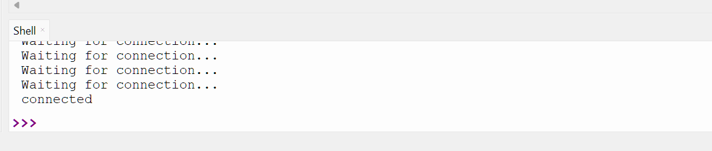
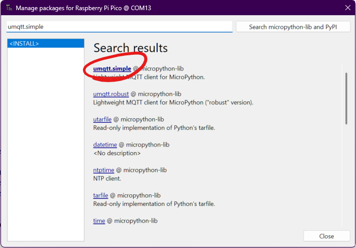

# 03 Connecting to MQTT Broker
In this exercise we will be learning how MQTT can be used used as a way for smart home devices to communicate with each other.


## Connecting the Pi Pico to Wi-Fi

1. Go to the top of Thonny and click "file"➡️"new". Then "file"➡️"Save as..."➡️"This computer". Call the  new file something like "MQTT.py" 

2. There are many wireless protocols smart homes can use. Today we are using Wi-FI

    The following code gives the Pi Pico the wifi credentials then connects it to the Wifi.
    
    **Copy and run this code.**

    ```python
    import network
    import time

    # Define Wi-Fi credentials
    SSID = 'NETGEAR05'
    PASSWORD = 'fuzzycurtain251'

    #Connect to WLAN as a client
    wlan = network.WLAN(network.STA_IF)
    wlan.active(True)
    wlan.connect(SSID, PASSWORD)

    #Loops until sucessfully connected
    while wlan.isconnected() == False:
        print('Waiting for connection...')
        time.sleep(1)
    print('connected')
    ```
    If it works successfully after waiting a few seconds you should see the following printed at the bottom of Thonny:
    

## What is MQTT and what is a broker?
MQTT is a lightweight protocol that smart home devices can use to communicate with each other.

Under MQTT, smart home devices send "messages" to a central "broker" - in this case, one called eclipse mosquito, running on a Orin Nivida Jetson. Each message includes a "topic," such as `sensor/temperature/livingRoom`

The broker's job is to forward these messages to the appropriate MQTT devices. Devices "subscribe" to specific topics to receive messages. For example, an air conditioning unit might subscribe to `sensor/temperature/livingRoom` to get sent data from a temperature sensor in order to automatically adjust its cooling power based on the living room temperature.


## Connecting to the broker

2. By default the MQTT library is not installed. To install, at the  top of Thonny, click "Tools"➡️"Manage packages...". Then search `umqtt.simple` and click on the result highlighted in  the picture.

Click "Install" and when it is finished,  "Close".

2. We need to import a MQTT library. Add this to the top of the existing code
    ```python
    from umqtt.simple import MQTTClient
    ```
3. The following code tells the Pico where to find the MQTT broker on the local network.
Add the following to the bottom of the existing code. Make sure to change `UNIQUE NAME` to an actually unique name and replace `IP ADDRESS` with the one shown on the board.   

    **Add the following code to the bottom of you file, then run**
 

    ```python
    #MQTT setup
    server = "IP ADDRESS" #This is the IP address of the Mosquitto MQTT Broker
    serverPort = 1883 #This is the Mosquito MQTT Broker port
    clientId = "UNIQUE NAME" #Your Pi Pico needs to have a unique name

    client = MQTTClient(clientId, server, serverPort)

    #Connect to Mosquitto Broker
    client.connect()
    print('Connected to MQTT Broker ' + server)
    ```

   If it worked you will see a success message printed in the Thonny shell..

   


