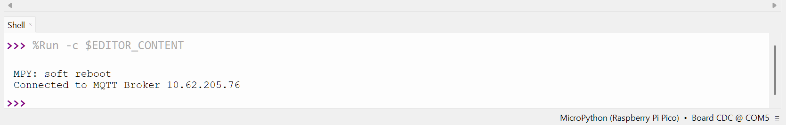

# 03 Home Assistant

Home Assistant is an open-source smart home platform that works plug-and-play with many smart devices. It can be run on your own hardware. For this workshop, we have it running on a laptop connected to its own dedicated Wi-Fi network.  

It also lets you integrate your own custom smart devices, which is exactly what we are doing today.

## 01 Connecting the Pico to Wi-Fi
There are many wireless protocols smart homes can use. Today we are using Wi-FI

We need to give the Pico the Wi-Fi credentials.
Create a new Python file called something like "HomeAssistant.py" and type this code:

```python
import network
import time

# Define Wi-Fi credentials
SSID = '?????DONT KNOW YET??????'
PASSWORD = '???DONT KNOW YET????'

#Connect to WLAN as a client
wlan = network.WLAN(network.STA_IF)
wlan.active(True)
wlan.connect(SSID, PASSWORD)

#Loops until sucessfully connected
while wlan.isconnected() == False:
    print('Waiting for connection...')
    time.sleep(1)

```

## 02 Connecting to Home Assistant
The Pico is going to communicate with Home Assistant using a lightweight protocol called MQTT.  

Smart home devices send out "messages" to a central "broker", in this case one running inside Home Assistant. Each message sent has a "topic", for example, `sensor/temperature/livingRoom`.

Other smart home devices "subscribe" to certain topics, which tells the broker to forward relevant messages to them. For example, your smart blinds might subscribe to a temperature sensor to adjust automatically based on the room's temperature.

In our setup, Home Assistant can also subscribe to these topics to display live data directly on a dashboard.

1. We need to import a MQTT libary. Add this to the top of your code
    ```python
    from umqtt.simple import MQTTClient
    ```
    Add this to the bottom of your code. Make you change `UNIQUE NAME` to a actually unique name . Replace `IP ADDRESS` with the one shown on the projector.

    ```python
    #MQTT setup
    server = "IP ADDRESS" #This is the IP adress of Home Assistant
    serverPort = 1883 #This is Home Assistants port
    username = "TinkerLab" #Home assistant UserName
    password = "TinkerLab" #Home assistant Password
    clientId = "UNIQUE NAME"#Your Pi Pico needs a uique name


    client = MQTTClient(clientId, server, serverPort, username, password)

    #Connect to Home Assistant
    client.connect()
    print('Connected to MQTT Broker '+server)
    ```
    This code tells the Pico where to find the MQTT broker and provides the username and password to authenticate. 

   Try running the code! If everything is connected properly, you will see a success message printed in the Thonny shell. You may also see your Pico's connection event appear in the live broker logs on the projector screen.

   

## 03 Sending a message

    