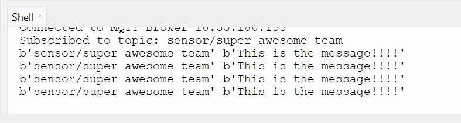

# 04 Sending Messages Between Devices. 
Now we know how to connect the pi pico's to the broker its time to send messages between devices.

**Make a pair with someone else that has a Pi Pico**. If you need  help finding someone, ask a representative. One persons Pi Pico will be sending the messages and the other persons will be receiving the messages. 

## The sending Pi Pico

We need to tell one of the Pi Pico's to send its messages to a topic called `sensor/pairName`. You need to set the variable, `pairName` to a unique name, for your pair. 

Every 2 seconds `client.publish` is called to publish  the message to that topic.

**One of the members of the pair should add the following to bottom of there existing code in Thonny**. 

```python
#You need to give your pair a unique name
pairName = "UNIQUE PAIR NAME"

#The topic 
publishTopic = "sensor/"+pairName

#Loops forever
while True:
    #Publish  the message every 2 seconds
    client.publish(publishTopic, "This is the message!!!!")
    time.sleep(2)
```

## The receiving Pi Pico

The other Pi Pico needs to subscribe to any messages sent to the topic `sensor/pairName`. `client.check_msg()` is continusly run and when a message is received, `messageRecieved` gets called.

**The other member of the pair should replace all of there code with  the following.** Make sure `clientId` is still changed to something unique, `IP ADDRESS` is the IP address shown on the board and `pairName` matches that of your pair.

```python
import network
import time
from umqtt.simple import MQTTClient


# Define Wi-Fi credentials
SSID = 'NETGEAR05'
PASSWORD = 'fuzzycurtain251'

#Connect to WLAN as a client
wlan = network.WLAN(network.STA_IF)
wlan.active(True)
wlan.connect(SSID, PASSWORD)

#Loops until sucessfully connected
while wlan.isconnected() == False:
    print('Waiting for connection...')
    time.sleep(1)
print('connected')


#Gets called when a message is received from  the other Pi Pico
def messageRecieved(topic, message):
    print(topic, message)
    

#MQTT setup
server = "IP ADDRESS" #This is the IP address of the Mosquitto MQTT Broker
serverPort = 1883 #This is the Mosquito MQTT Broker port
clientId = "UNIQUE NAME" #Your Pi Pico needs to have a unique name
    
client = MQTTClient(clientId, server, serverPort)
client.set_callback(messageRecieved) #Says what gets called when a messaged is received
client.connect()
print('Connected to MQTT Broker ' + server)


#Subscribing the Pico your pairs topic
pairName = "UNIQUE PAIR NAME"
subscribeTopic = "sensor/" + pairName
client.subscribe(subscribeTopic)
print('Subscribed to topic: ' + subscribeTopic)


#Checks for new messages forever
while True:
    client.check_msg()
```

Try run the new code on  both the Pi Pico's. After waiting a few seconds the partner with the receiving Pi Pico should see the the messages being received in Thonny:  
