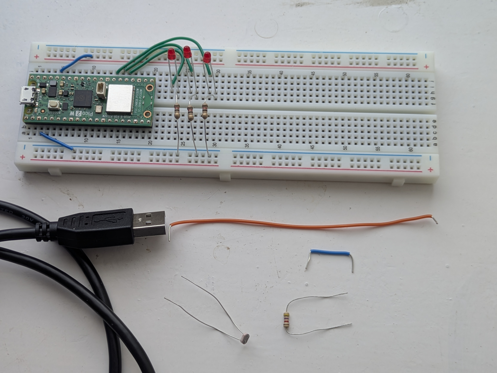
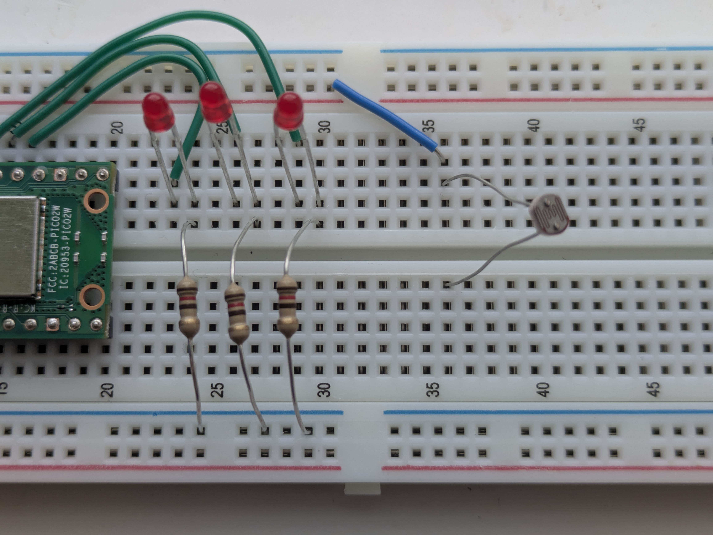
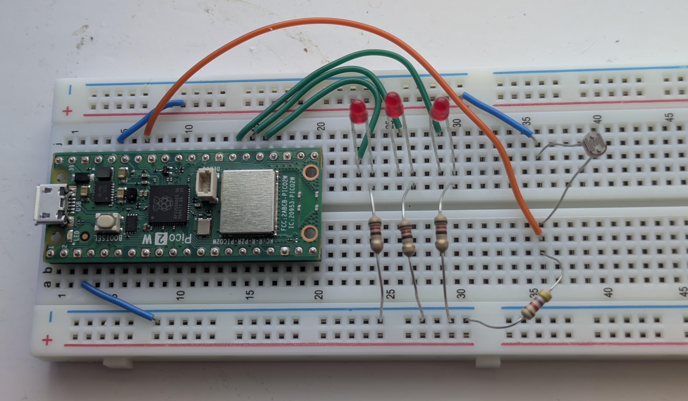

# Adding Back in the Hardware

In this exercise you will be building a remote light switch. One Pi Pico will have a light sensor (LDR) on it and, it will send data to the other Pi Pico which will use  PWM to dim itself accordingly to the  light levels.

## How do we use a LDR?
A light dependent resistor changes how much resistance it has based on the amount on light hitting it. 

We can connect it in series with a resistor, between ground and voltage. Some of the voltage gets lost in the resistor and some in the LDR. when  the resistance of the LDR changes, a different amount voltage gets lost across the LDR. This is called a voltage divider.

We can measure this voltage lost across the LDR by connecting it to one of the Pi Pico's pins. The voltage measured will change when the LDR's resistance changes, therefore it changes when the light intensity changes.


## Adjusting the  sending Pi Pico's breadboard
The Pi Pico with the code that sends the messages needs to have a LDR and Resistor added to its breadboard. Work on this still in your pair.

You will need the following components:
- 1x LDR
- 1x 4k7R resistor (may be a blue colour instead of brown)
- 2x jumper wire. Have a look at the pictures to get the right lengths.  

  


1. First unplug the Pi Pico
2. Connect one of the legs on the LDR to 3.3V via a breadboard wire, as shown in the picture

> [!NOTE]   
>Please note that the gap in blue and red lines on the breadboard indicates either side is not electrically connected to each  other.
3. Use a a bread board wire to connect the other leg the pin on the Pico shown in the picture. Also connect the other leg to ground via the 4k7R resistor

4. After you have check your  connections replug your Pi Pico
4. Press the stop button at near top of Thonny for it to to be recognized again.

## The sending Pi Pico

As a pair you need to adjust the code. So that data about the amount of light is sent in the messages.

By using `ldr.read_u16()` we can get a 16 bit value back for the voltage on that pin. Meaning if the pin measures 3.3V it returns 65, 535 for 3.3 volts and if it measures 0V it returns 0.  

**Replace your entire `while True` loop in the sending Pi Pico's code with the following:**
  
```python
# Setup ADC on GP28 to read that pins voltage
ldr = machine.ADC(28)

#Loops forever
while True:
    voltageMeasurement = ldr.read_u16(); #reads the voltage
    print(voltageMeasurement)
    client.publish(publishTopic, str(voltageMeasurement)) #publishes the voltage reading
    
    time.sleep(0.05) #Loop every 50 milliseconds
```

## The receiving Pi Pico

We need to change the code on the receiving Pi Pico so that it uses PWM  to adjust the  brightness of its LEDs based on the message sent by the sending Pi Pico.

Because the PWM takes also takes a 16 bit value, we don't need to do anything to 16 bit value received from the other Pi Pico.

**Replace the code on  the receiving pi pico with the following:** Make sure `clientId` is still changed to something unique, `IP ADDRESS` is the IP address shown on the board and `pairName` matches that of your pair.

```python
import network
import time
from umqtt.simple import MQTTClient
from machine import Pin, PWM


#define the LEDs pins
led1 = Pin(19, Pin.OUT)
led2 = Pin(20, Pin.OUT)
led3 = Pin(21, Pin.OUT)

#Set up PWM on those pins
pwmled1 = PWM(led1, freq=5000)
pwmled2 = PWM(led2, freq=5000)
pwmled3 = PWM(led3, freq=5000)


# Define Wi-Fi credentials
SSID = 'NETGEAR05'
PASSWORD = 'fuzzycurtain251'

#Connect to WLAN as a client
wlan = network.WLAN(network.STA_IF)
wlan.active(True)
wlan.connect(SSID, PASSWORD)

#Loops until sucessfully connected
while wlan.isconnected() == False:
    print('Waiting for connection...')
    time.sleep(1)
print('connected')


#Gets called when a message is received from  the other Pi Pico
def messageRecieved(topic, message):
    print(topic, message)
    
    #Setting the brighness of the LEDs using PWM
    pwmled1.duty_u16(message)
    pwmled2.duty_u16(message)
    pwmled3.duty_u16(message)
        

#MQTT setup
server = "IP ADDRESS" #This is the IP address of the Mosquitto MQTT Broker
serverPort = 1883 #This is the Mosquito MQTT Broker port
clientId = "UNIQUE NAME" #Your Pi Pico needs to have a unique name
    
client = MQTTClient(clientId, server, serverPort)
client.set_callback(messageRecieved) #Says what gets called when a messaged is received
client.connect()
print('Connected to MQTT Broker ' + server)


#Subscribing the Pico your pairs topic
pairName = "UNIQUE PAIR NAME"
subscribeTopic = "sensor/" + pairName
client.subscribe(subscribeTopic)
print('Subscribed to topic: ' + subscribeTopic)


#Checks for new messages forever
while True:
    client.check_msg()
```

## Running the code
1. Run the code on both the Pi Pico's.  
2. When you shine your phones torch on the LDR you should see the LEDs increase in brightness. When you cover the LDR with your hand you should see the LEDs dim.
3. Congratulations, you have successfully created a WiFi connected smart sensor and smart device!


